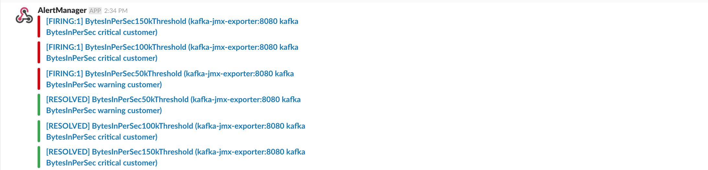

# kafka-prometheus-alertmanager-monitoring
Dockerised example of monitoring [Apache Kafka](https://kafka.apache.org/) with [Prometheus](https://prometheus.io/) [Alert Manager](https://prometheus.io/docs/alerting/alertmanager/) and [Grafana](http://grafana.org/).  This project makes use of the prometheus-jmx-exporter which is configured to extract metrics from Kafka's JMX server.  These metrics are then exposed via HTTP GET and polled by Prometheus. Prometheus will then trigger alerts in alertmanager which can then be received by Slack.

* [kafka.yml](../master/prometheus-jmx-exporter/confd/templates/kafka.yml.tmpl) - Kafka JMX polling configuration
* [prometheus.yml](../master/mount/prometheus/prometheus.yml) - Prometheus metric polling configuration
* [rules.yml](../master/mount/prometheus/rules/rules.yml) - Prometheus Alerting Rules
* [config.yml](../master/mount/alertmanager/config.yml) - Alert Manager Configuration
* [slack.tmpl](../master/mount/alertmanager/templates/slack.tmpl) - Slack Template for Alerts

## Pre-Requisites
* install Docker and Docker Compose - https://docs.docker.com/

## Usage

```
docker-compose up
```

- View Prometheus UI - `http://localhost:9090`
- Grafana UI - `http://localhost:3000` (admin:admin)
- Alert Manager - `http://localhost:9093`
- Alerts will hit your Slack instance once you have replaced the slack_api_url: and channel: values with the correct URL and channel of your choice in [config.yml](../master/mount/alertmanager/config.yml). Slack will generate the URL required when you add 'incoming-webhook' to your channel of choice. See here: https://api.slack.com/incoming-webhooks

### Sending Kafka messages
In order for the Kafka broker to expose JMX topic metrics you must send some messages to the topics. The best way to achieve this is to download Kafka from here: https://kafka.apache.org/downloads (I used 1.0.0) and use the Kafka Console Producer.
```
cat 100k-messages | ./kafka-console-producer.sh --broker-list localhost:9092 --topic customer
cat 100k-messages | ./kafka-console-producer.sh --broker-list localhost:9092 --topic audit
```
When applying messages to the system you will see an increase in the Bytes In metrics in Grafana.

### Viewing Prometheus Metrics
The kafka metrics are pulled into Prometheus via the JMX exporter.  These can be viewed in Prometheus by navigating to `http://localhost:9090/graph`, enter a metric name to view the graphs.


### Viewing Graphs in Grafana
Grafana can be used to build a more meaningful dashboard of the metrics in Prometheus, navigate to Grafana on `http://localhost:3000` (admin:admin).  An example dashboard is available to import in `dashboards/Kafka.json`. You must add Prometheus as a data source on https://localhost:9090 (direct) and called the data source 'Prometheus'.


### Alerts in Alert Manager
Applying enough load to the topics will cause an alert to be triggered. The rules set in [rules.yml](../master/mount/prometheus/rules/rules.yml) are for 50k Bytes In, 100k Bytes In, 150k Bytes In and 90% CPU. When applying messages to the topics using the aforementioned commands you'll see the alerts triggered in Alert Manager.


### Alerts in Slack
When the Alert Manager receives the alert state from Prometheus the API call is made to Slack webhooks to display the alert in your chosen slack channel. Taking the pressure off Kafka by stopping sending messages to the topics will bring the bytes in down and the alarms will resolve.


